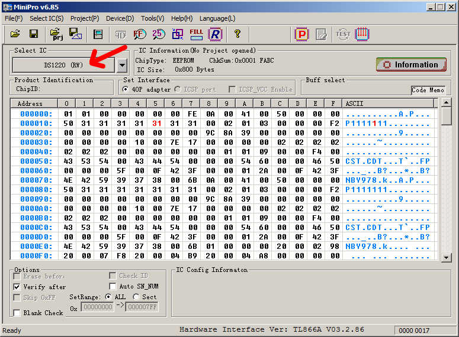
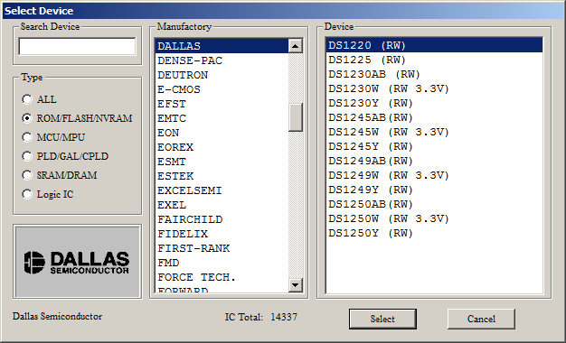
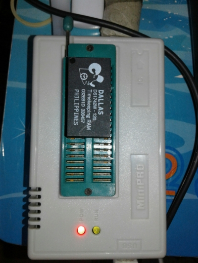
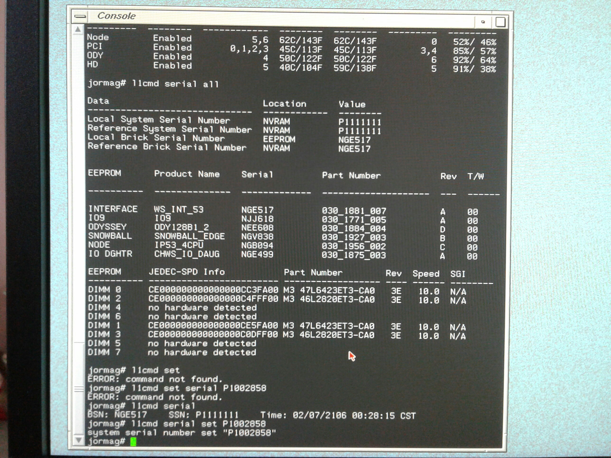

# SGI Stuff
Contain bits and informations about SGI, mainly SGI Tezro.

# Table of content
- SGI Tezro NVRAM

# SGI Tezro NVRAM
Once upon a time, I have "accidentally" render my Tezro not turn on with "no system serial number assigned" error message at the front LCD display, after I gutted the battery out of the Dallas DS1742W-120 RTC/NVRAM and replace it with typical CR2032 socketed battery that use in PC, thinking it would fix annoying clock reset every time I turn the Tezro off.

And worst, I can't use null-modem cable to try to set the serial number through L1 no matter what I try, due to my Tezro's Interface Board have broken L1 console port for some reasons (the L1 operate normally and output message about VRMs, but can't enter L1).

Luckly, I have found a listing of new SGI Tezro Interface Board with Dallas DS1742W-120 on ebay and I brought it, just for the Dallas DS1742W-120... rip my wallet.

I'm using MiniPro TL866A programmer to read/write the Dallas DS1742W-120 use in SGI Tezro and SGI Fuel, because of the low cost (around 100 usd on ebay, not include shipping) and it can read/program most memory chip use in old computer and can work on both Windows and Linux (with minipro-git and qtl866-git).

The profile I use is DS1220 (RW) to read/program the DS1742W-120 due to DS1220 have same pinout to DS1742. (You can find it when you "Select Device" with Type: ROM/FLASH/NVRAM, Manufactory: DALLAS, Device: DS1220 (RW) ) and when you program the NVRAM and verify it, ignore the error in offset 2040 to 2047 as it related to the RTC and will change every second.

Don't worry about difference VCC of DS1742W (3.3v) and DS1120 (5.0v), as from the datasheet, it still with in spec of DS1742W.

**[MiniPro TL866 setting]**

**[DS1742W-120 orentation]**

DS1220 datasheet: https://datasheets.maximintegrated.com/en/ds/DS1220AB-DS1220AD.pdf
DS1742 datasheet: https://datasheets.maximintegrated.com/en/ds/DS1742.pdf

After you program the new DS1742W-120 using the image I have backup from the new Interface Board ([IP53_WKSTN_INTFC_DS1742W-120_030-1881-007_RevA.BIN](../master/Tezro/IP53_WKSTN_INTFC_DS1742W-120_030-1881-007_RevA.BIN)) and put the programmed DS1742W-120 to your SGI Tezro.

If you can enter L1 using console serial port, use this command to set the serial number.

`serial set P1006969`

If you can't enter L1, boot in to IRIX and use this command in root user (or using su).

`l1cmd serial set P1006969`

Where P1006969 is your serial number at the back of your Tezro, then reset L1 or restart Tezro completely (shutdown and pull the plug out).

**[Setting serial number]**

No more "no system serial number assigned" error message at the front LCD display anymore :D
