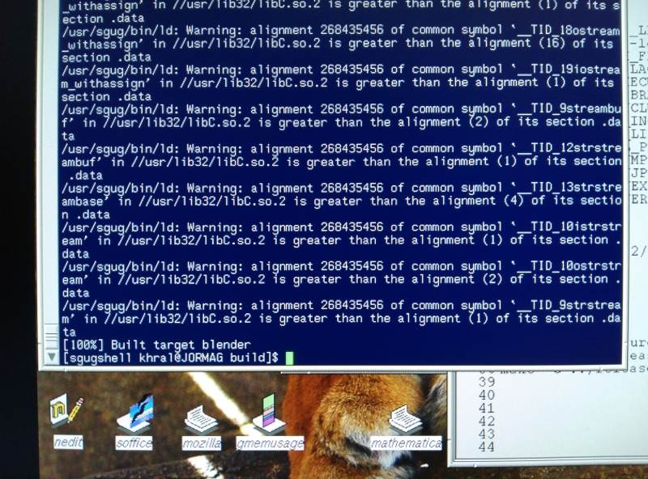
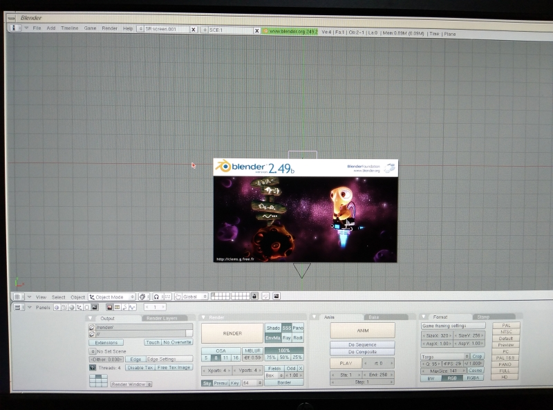

Compile Blender 2.49b with sgug-rse - The Tutorial
==================================================
Few days ago, I have some free times to do stuff, so I decided to try compile Blender 2.49b with sgug-rse.

This would be good starting point in case anyone want to port newer Blender to IRIX, like Blender 2.76b
(the last version to support OpenGL 1.x) or Blender 2.79b by patch it to use OpenGL 1.x.

It took me sometimes with a lots of trial and errors as there aren't any documentations about compiling Blender on IRIX anywhere I have search.

The result is it compile and link without error and the binary works too! \OwO/

Here is the step I took to compile Blender 2.49b with sgug-rse, the compile step I based from [blender249 AUR](https://aur.archlinux.org/packages/blender249/)

I assume you know a bit on how to compile stuff from source.
Sorry for the picture isn't screen capture, as it a trouble to transfer screenshot with secondary SCSI HDD to/from my PC.
I didn't get my Tezro on network yet.

Note that I didn't include OpenEXR support due to v2.5.6 give compile error with sgug-rse.
There seems to be OpenEXR package in wip branch of sgug-rse tho but I have no time to look into the wip branch yet. :<

Install sgug-rse
----------------

Install sgug-rse-0.0.7beta on your SGI using given instructions from [https://github.com/sgidevnet/sgug-rse](https://github.com/sgidevnet/sgug-rse)

on the step 8 "install packages", choose "Install everything" step or just install what you need.

After finished install, remove xorg-x11-proto-devel package to prevent errors during linking.

```bash
sudo tdnf remove xorg-x11-proto-devel
```

To use sgug-rse, run this command in the terminal

```bash
/usr/sgug/bin/sgugshell
```

Compile and install libSDL
--------------------------

I'm using SDL 1.2.15 from [https://github.com/libsdl-org/SDL-1.2/](https://github.com/libsdl-org/SDL-1.2/)

```bash
cd SDL-1.2.15
./autogen.sh
./configure
make && make install
```

Compile and install OpenAL
--------------------------

I'm using source code from Nekoware since it was already avaliable on my Tezro

```bash
cd openal-1.1/linux
./autogen.sh
./configure
make && make install
```

Prepairing Blender 2.49b source code
------------------------------------

Download and extract Blender 2.49b source code from [https://download.blender.org/source/blender-2.49b.tar.gz](https://download.blender.org/source/blender-2.49b.tar.gz)

Download blender249py27_gcc9_all.patch from [https://aur.archlinux.org/cgit/aur.git/tree/?h=blender249](https://aur.archlinux.org/cgit/aur.git/tree/?h=blender249)

and put the patch into extracted blender-2.49b directory.

Download blender-2.49b-15.fc15.src.rpm from [https://archives.fedoraproject.org/pub/archive/fedora/linux/releases/15/Fedora/source/SRPMS/blender-2.49b-15.fc15.src.rpm](https://archives.fedoraproject.org/pub/archive/fedora/linux/releases/15/Fedora/source/SRPMS/blender-2.49b-15.fc15.src.rpm)

and extract the rpm file using this command

```bash
bsdtar -xvf blender-2.49b-15.fc15.src.rpm
```

put blender-2.49b-uid.patch and blender-2.49b-cve.patch into extracted blender-2.49b directory.

```bash
cd blender-2.49b

# patch blender 2.49b for newer gcc and python
dos2unix extern/bullet2/src/BulletSoftBody/btSoftBodyInternals.h
dos2unix source/gameengine/Ketsji/KX_PolygonMaterial.cpp
patch -Np1 -i blender249py27_gcc9_all.patch
patch -Np1 -i blender-2.49b-uid.patch
patch -Np1 -i blender-2.49b-cve.patch
```

Edit blender-2.49b/intern/elbeem/intern/utilities.cpp at line 51, change

```c++
return (getElbeemState>=0);
```

to

```c++
return (getElbeemState()>=0);
```

This will finish preparing the source code, or alternately, use the already patched code from my github repo [https://github.com/kytulendu/blender-2.49b](https://github.com/kytulendu/blender-2.49b)

Compile Blender 2.49b
---------------------

```bash
cd blender-2.49b

mkdir build && cd build

# change to -march=mips3 or -march=mips4 to match your machine
cmake \
    -DCMAKE_EXE_LINKER_FLAGS:STRING="-lmoviefile -lmovieplay -ldmedia -lGL -lGLcore -lX11 -ldl -lpthread -lWl,--allow-shlib-undefined" \
    -DCMAKE_CXX_FLAGS:STRING="-O2 -march=mips4 -fcommon -fpermissive" \
    -DCMAKE_C_FLAGS:STRING="-O2 -march=mips4 -fcommon" \
    -DPYTHON_EXECUTABLE:PATH=/usr/sgug/bin/python2 \
    -DPYTHON_LIBRARY:PATH=/usr/sgug/lib32/libpython2.7.so \
    -DPYTHON_INCLUDE_DIR:PATH=/usr/sgug/include/python2.7 \
    -DFREETYPE_INC:PATH=/usr/sgug/include/freetype2 \
    -DFREETYPE_LIB:PATH=/usr/sgug/lib32/libfreetype.so.6 \
    -DOpenGL_GL_PREFERENCE:STRING="LEGACY" \
    -DWITH_OPENMP:BOOL=ON \
    -DWITH_OPENJPEG:BOOL=ON \
    -DWITH_OPENEXR:BOOL=OFF \
    -DWITH_PLAYER:BOOL=ON \
    ../

# use "make -j 2" to use 2 cpus to compile blender
# use "ninja" if you add "-GNinja" flag to cmake
make
```

no errors yay!!



```bash
# build plugins
cp -r ../release/plugins ./bin
mkdir -p ./bin/plugins/include
cp ../source/blender/blenpluginapi/*.h ./bin/plugins/include
chmod +x ./bin/plugins/bmake

# edit ./bin/plugins/bmake
# copy CC, CFLAGS, LD, LDFLAGS from Linux portion to IRIX64

make -C ./bin/plugins
```

And run blender.

```bash
# run blender
cd bin
./blender
```

Success!!!!



Benchmark
---------

Using test.blend from [Ian's SGI Depot](http://www.sgidepot.co.uk/blender.html) on SGI Tezro R16000 800Mhz X4 4MB L2 Cache, 3GB RAM, IRIX 6.5.22

1 render threads
- official Blender 2.49a                        06:22.55
- self build Blender 2.49b (-O2 -march=mips3)   06:34.49
- self build Blender 2.49b (-O2 -march=mips4)   06:21.90

4 render threads
- official Blender 2.49a                        01:54.97
- self build Blender 2.49b (-O2 -march=mips3)   01:58.50
- self build Blender 2.49b (-O2 -march=mips4)   01:53.03

8 render threads
- official Blender 2.49a                        01:56.86
- self build Blender 2.49b (-O2 -march=mips3)   01:51.57
- self build Blender 2.49b (-O2 -march=mips4)   01:48.75
