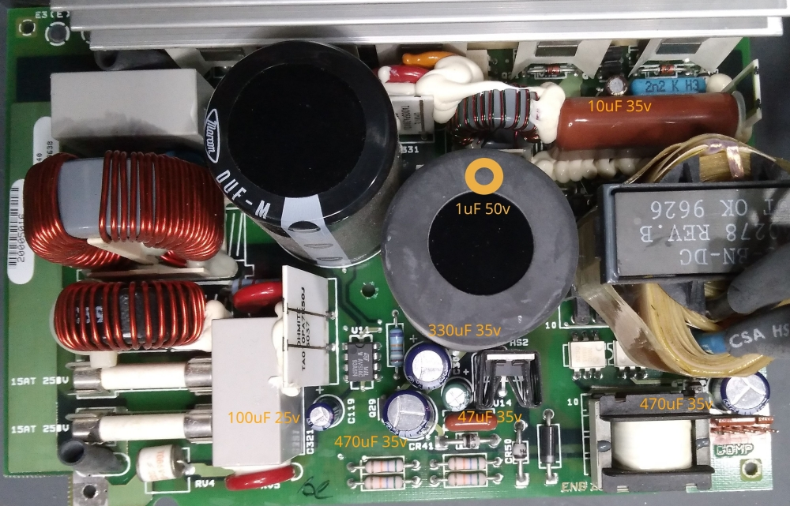
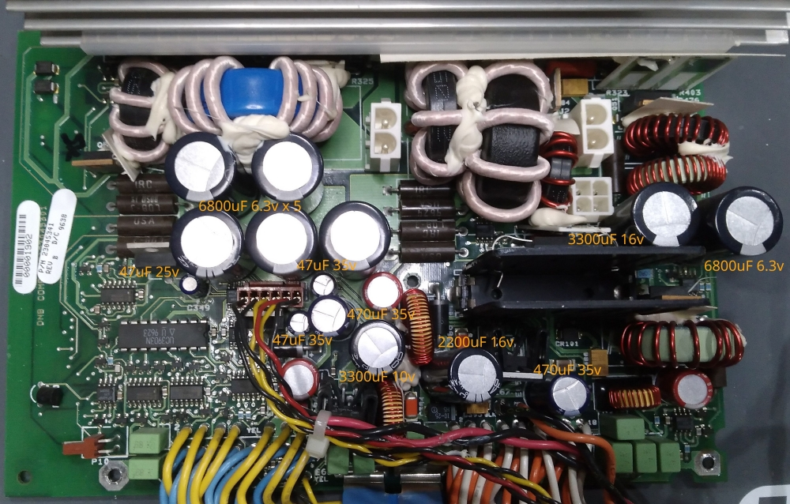

SGI Indigo 2 PSU
================

ZYTEC 385W (P/N 060-0021-001 REV C)
-----------------------------------

Specs

    ZYTEC 385W  SGI P/N:060-0021-001 REV C

    +5.0V/40.0A
    +3.5V/48.0A
    +3.5V/12.0A
    +12.0V/4.25A
    -12.0V/0.5A
    -5.0V/0.8A
    +5.0V AUX/0.1A

HV board capacitor list

    1uF 50v         x1
    10uF 35v        x1
    47uF 35v        x1
    100uF 25v       x1
    330uF 35v       x1
    470uF 35v       x2

LV board capacitor list

    47uF 25v        x1
    47uF 35v        x2
    470uF 35v       x2
    2200uF 16v      x1
    3300uF 10v      x1
    3300uF 16v      x1
    6800uF 6.3v     x6

PSU fan is Panaflo FBA09A12V

More information on SGI Indigo 2 power supply
---------------------------------------------
- [Indigo 2 Power Supply Basics](https://forums.sgi.sh/index.php?threads/indigo-2-power-supply-basics.111/)
