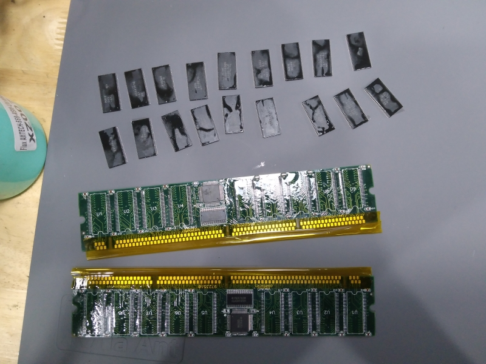
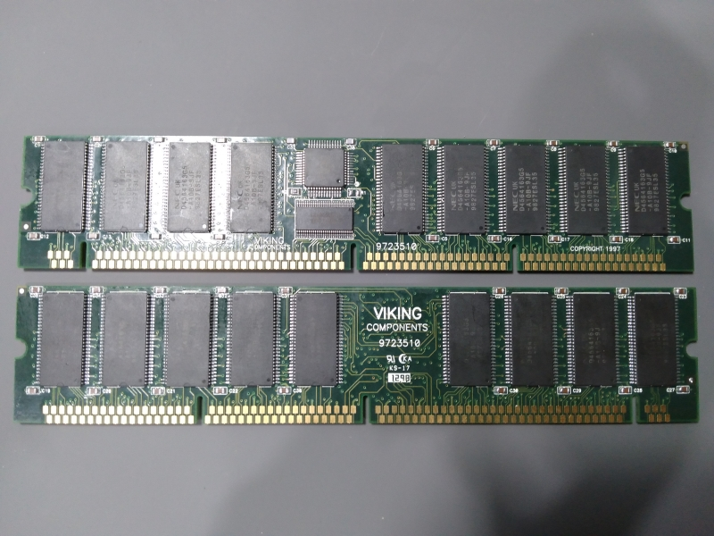
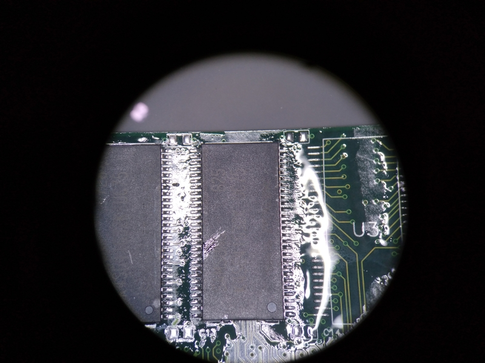
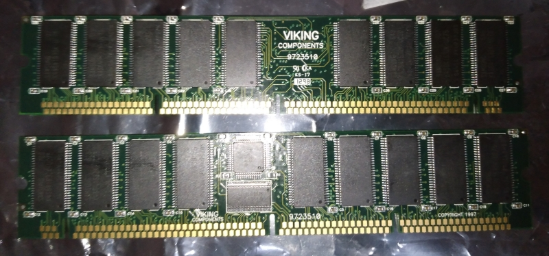
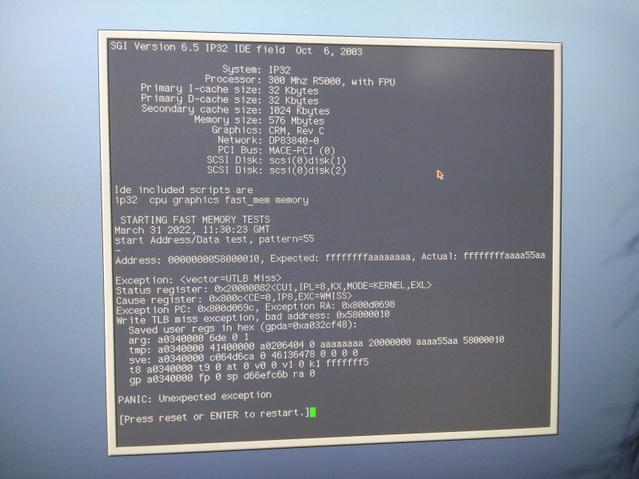
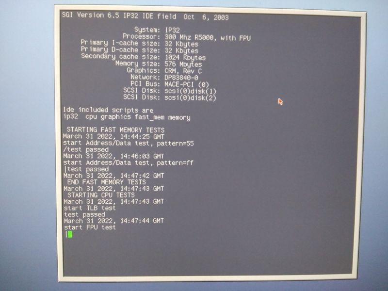
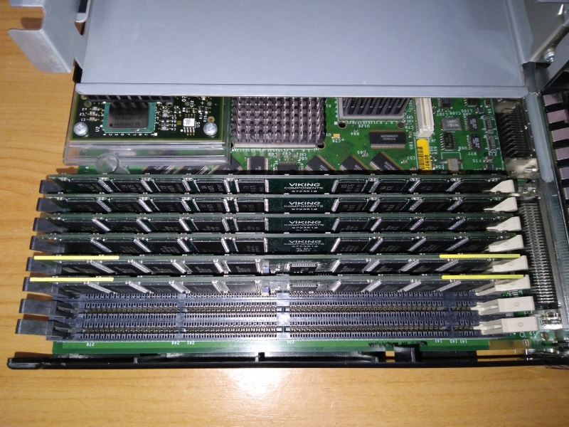

SGI O2 memory upgrade - The hard way
====================================
**Caution: This is for educational purpose only. If you want to do this modification, make sure you know what you going to do before decided to try this. I take no responsibility if you broke your expensive and hard to find O2.**

Why?
----
~~Why not~~ My SGI O2 have only 320MB of RAM and I'd like to run Maya 6.5 and doing some software development on it. So I won't have to use my Tezro often, which will reduce my electric bill (~300W for Tezro VS ~80-90W for O2) and make my small room more cooler.

How?
----
When I have researching stuff about SGI O2, I have noticed that O2 memory DIMMs didn't have SPD chip like SDRAM DIMMs or present detect pins or jumpers like the 72 pin SIMMs used on Indigo2 or PCs. The 2 chips on O2 DIMMs, 74ALVCH16721 (flip-flop with 3-state outputs and bus-hold) and CDC2586 (Phase-lock loop clock driver with 3-state outputs), aren't for memory size detection either.

Along with O2 16MB and 32MB DIMMs use the same PCB with 16MB DIMMs have only 1 side of memory chips populated. This lead to conclusion that SGI O2 detect amount of memory by counting it at PROM boot.

To confirm this theory, I decided to modify 4 of my 64MB O2 DIMMs by desolder all 2 DIMMs SDRAM chips and capacitors (except 2 capacitors near CDC2586), then solder it to unpopulated SDRAM pads of annother 2 64MB O2 DIMMs to make it into 128MB DIMMs.

Desoldering the memory chips

Modified 64MB to 128MB O2 DIMMs

O2 blank DIMMs (high-res picture)

Desoldered 74ALVCH16721 and CDC2586 in case someone want to reverse engineer O2 DIMMs PCB (high-res picture)

The upgraded DIMMs do pass memory test and run for a few days without issue! :3

With 2 blank DIMMs remain from the upgrade, I odered 30 of cheap Samsung K4S641632K-UC75 from aliexpress (I know it may be desoldered chips, which it is) to populate the blank pads. I choose this variant of K4S641632 for it's low power consumption as it operating current (one bank) is about 55mA compared to 100 of mA of other variant.

Below is what memory chips SGI O2 DIMMs use from pictures on the internet and from my O2 DIMMs for reference

    16MB and 32MB O2 DIMM       NEC D4516161G5-A10-7JF, Hitachi HM5216165TT10
    64MB and 128MB O2 DIMM      Samsung K4S641632C-TL10, Samsung K4S641632K-UC75*,
                                Samsung KM416S4030CT-GL, NEC D4564163G5-A10B, V54C365164VBT8PC
    * Used in this upgrade, not found on SGI and 3rd party O2 DIMMs

The capacitors on DIMMs is 100-200 nF
Two capacitors near CDC2586 is currently unknown (I forgot to measure it :c)

Fast forward next month, the SDRAM chips arrived.

K4S641632K-UC75 in tube

I proceeded to solder all the SDRAM chips and Capacitors...

Fun time!

and have another 2 of 128MB DIMMs :3

But this time it failed memory test as some RAM pins didn't get soldered properly due to some of the SDRAM chips pins are bent (as it was desoldered chips) and I was somewhat tried when doing this after work...

After recheck all the RAM pins with magnifying glass and resolder the problematic pins, it now pass the RAM test \owo/

Memtest success!

All 4 of upgraded DIMMs populated

My O2 now have 576MB of memory from 320MB, enough to run Maya 6.5 and doing software development work with modern toolchain (sgug-rse) :3
