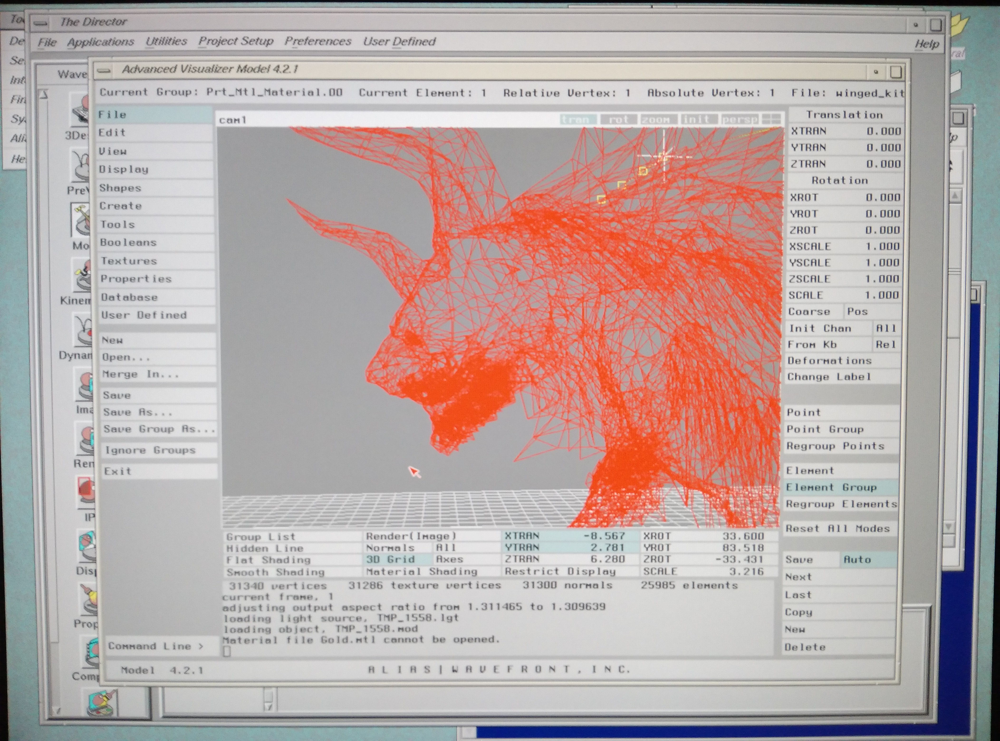

Alias|Wavefront The Advanced Visualizer notes
=============================================


TAV 4.2.1 running on SGI Indigo2 R4400 250Mhz with GU1-Extreme graphic card, IRIX 6.5.22

Excerpt from my post at https://forums.sgi.sh/index.php?threads/wavefront-advanced-visualizer.374/

TAV 4.2.1 can run on IRIX 6.5.22 with some modifications in TAV launch scripts and launch command, including Advanced Visualizer Model. At least on my Indigo2 R4400 250Mhz with GU1-Extreme graphic card.

It may run on Indigo2 R10000 or R4400 with Impact graphic card or Octane with Impact graphic. I have no Octane or Indigo2 R10000 or Indigo2 Impact graphic card to test if it did run and work properly.

If you have Alias|Wavefront Explore Professional newer than v4.2.1 installed and it doesn't have render program in /usr/aw/EXP4.3.x/bin, TAV Render will not work (missing render program error), to fix it you have to uninstall the newer version and use v4.2.1.

TAV 4.2.1 can be run on SGI Tezro with V12 graphic card, but with issue of Advanced Visualizer Model and PreView have corrupted graphic in viewport (unusable) but all other programs seems to work.

Be minded, if the model is high/very high poly model, even if the model fit with in memory of your SGI or the model have improper .obj format that TAV didn't support, it may crash Model or PreView program.

The lastest release of TAV is version 4.3.2 according to qualified hardware list on old Alias|Wavefront website
[MediaStudio 4.3.2 Qualification Chart](https://web.archive.org/web/20030622235814/http://www.aliaswavefront.com/en/Community/Support/qualified_hardware/QUAL/ms_4.3.2.html)

Getting TAV 4.2.1 to run on IRIX 6.5.22
---------------------------------------

This is how I get it to work on my Indigo2 with IRIX 6.5.22, I don't remember what I have edited, other than /usr/aw/COM/setup/auto_env that i'm pretty sure it haven't been modified (or not) so I'm typing the content of almost every startup scripts of TAV on my Indigo2 below.

In ~/.cshrc in my profile
```bash
...
source /usr/aw/COM/setup/awsetup
...
```

In ~/.aw_custom_env in my profile
```bash
...
# Check to see if IPR/Render is installed
#
#which ipr >& /dev/null
#if ($status) then
#    setenv AW_PROD_ENV    tav
#else
    setenv AW_PROD_ENV    tavipr
#endif

setenv WF_PROJ_PATH $HOME/projects/Sample
setenv WF_PRJ_DIR $HOME/projects
#setenv WF_TABLET wacom

# setenv WF_DEVICES ~/devices
# setenv WF_CMD_DIR ~/projects/bin
# addpath $WF_CMD_DIR/bin

setenv WF_AUDIO_DIR    $WF_PROJ_PATH/audio
setenv WF_CAD_DIR       $WF_PROJ_PATH/cad
setenv WF_CFG_DIR       $WF_PROJ_PATH/cfg
setenv WF_IMG_DIR       $WF_PROJ_PATH/images
setenv WF_OBJ_DIR       $WF_PROJ_PATH/objects
setenv WF_SHADER_DIR       $WF_PROJ_PATH/shaders
setenv WF_SCMP_DIR       $WF_PROJ_PATH/scene
setenv WF_TEX_DIR       $WF_PROJ_PATH/textures
setenv WF_TRAJ_DIR       $WF_PROJ_PATH/traj
setenv WF_TMP_DIR       /usr/tmp
setenv WF_MTL_DIR       $WF_PROJ_PATH/colors.mtl
```

in /usr/aw/COM/setup/awsetup
```bash
source /usr/aw/COM/setup/auto_env
if (-f /usr/aw/userconfig/shared_env) source /usr/aw/userconfig/shared_env
if (-f ~/.aw_custom_env) source ~/.aw_custom_env
```

in /usr/aw/userconfig/shared_env
may not need, but I'm not sure.
```bash
setenv LD_LIBRARY_PATH /usr/aw/COM/lib
```

And finally, a script to launch TAV Director. Copied from launch command used in TAV toolchest. I named this script `run_tav` and saved it in my profile directory, then dragged it to desktop.
You must run TAV from this script, else Model and PreView will hang at startup.
```bash
#/usr/bin/tcsh
/usr/sbin/xwsh -geometry 80x24+529+680 -iconic -title Director -icontitle Director -e $WF_AV_DIR/bin/director
```

TAV manuals
-----------

There is few documentation or tutorial of this software exist online :<
If you have TAV manual or training VHS, please consider scan/digitize it and upload it to archive.org.

Simple tutorial modeling a steam shovel, materials and light definition files from the tutorial are in [wavefront](../master/wavefront/) directory.

[Introduction to Wavefront](https://web.archive.org/web/19961225031932/http://www.cc.gatech.edu/gvu/people/Phd/Reid.Harmon/wave/)

Below listed the videos that show usage of TAV that I have found on the internet.

[Wavefront Pictureout - SGI Demo](https://www.youtube.com/watch?v=eZr0yU76leM)
at around 8:25 is demoing the usage of TAV to create presentation animation of a piston assembly.
including the usage of Model, Property, Preview, Image/Render?, Paint and Composer.

[Wavefront Gamewave Cyberworld 199x](https://archive.org/details/Wavefront_Gamewave_Cyberworld_199x_MKV)
This video demoing the usage of TAV for game creation.
including the usage of 3Design, Model, Kinemation, Dynamation and Composer.

bonus ;)

[Wavefront Movie 1986](https://www.youtube.com/watch?v=dolXi-3BcuA)
contain video screen of early version of Wavefront (later known as The Advanced Visualizer) running on SGI IRIS 2000 Series
