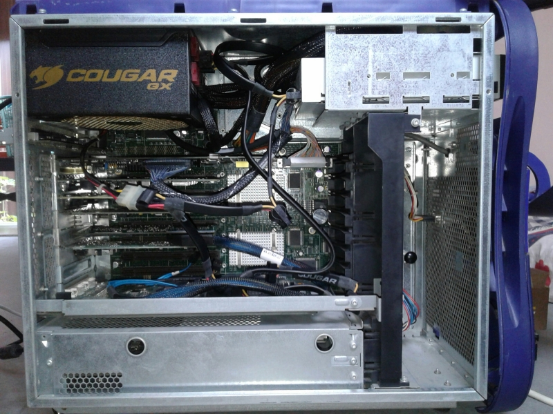
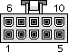

SGI Tezro power supply
======================
SGI often use proprietary power supply on their computer, fortunately the PSU use in SGI Tezro are standard ATX PSU-ish, and it was 12V heavy like modern PSU. And unlike SGI Fuel, it won't need the control connector to turn on.
So, technically we can put quality modern PSU in to SGI Tezro with some cable modification/adaptor.

My SGI Tezro with Cougar GX 1050W 80 PLUS Gold ATX PSU

DELTA DPS-550BB E Specs
-----------------------

    DELTA DPS-550BB E  SGI P/N:060-0162-002
    
    +3.3V/24.0A     +5.0V/24.0A
    +12.0V3/18.0A   +12.0V2/12.0A
    +12.0V1/8.0A    -12.0V/0.5A
    +5VSB/3.0A
    
    +12.0V1 is from Molex connector
    +12.0V2 is from ATX power connector
    +12.0V3 is from 10 pin MiniFit Jr 5557-10 female connector (P2)

10 pin MiniFit Jr 5557-10 female connector (P2) pinout
------------------------------------------------------

    Pin     Color       Description
    1       Black       Ground
    2       Black       Ground
    3       Black       Ground
    4       Black       Ground
    5       Black       Ground (sperate rail)
    6       Yellow      +12V2 (sperate rail)
    7       Yellow      +12V3
    8       Yellow      +12V3
    9       Yellow      +12V3
    10      Yellow      +12V3
    
    All wires are 18 AWG

More information on SGI Tezro power supply
------------------------------------------
- [Ugly Tezro power](https://forums.sgi.sh/index.php?threads/ugly-tezro-power.134/)
- [Tezro voltage regulators and rails](https://forums.sgi.sh/index.php?threads/tezro-voltage-regulators-and-rails.140/)
