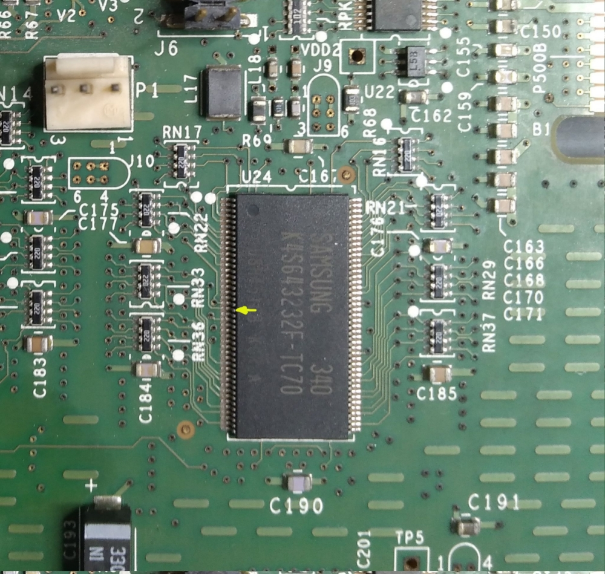

SGI Tezro VPro V12 256MB modification idea
==========================================

I think we might able to mod V12 to 256MB with 128 Mbit (4M x 32) SDRAM, from the picture of my V12,
pin 21 (yellow arrow) of the K4S643232F-TC70 memory chip seems to connect to somewhere,
which that pin is not connected according to data sheet but it was A11 pin on 128 Mbit (4M x 32) SDRAM.

It would probably work if we can source compatible 128 Mbit SDRAM chips and replace it.
Unless the PROM detect V12 memory from it's part number EEPROM or PROM/IRIX didn't have support V12 with 256MB VRAM.

I could try it on my current V12 board but I don't have another working spare V12, so not gonna risk it yet :P 
